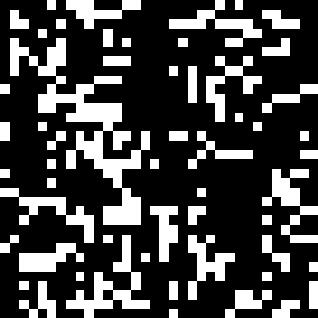

# Game of Life

This is a simple program that visualizes [Conway's Game of Life](https://en.wikipedia.org/wiki/Conway's_Game_of_Life) using OpenCV in C++.

The GOLAnimator class has the ability to detect still lifes and oscillators/blinkers with period up to 5. When these are detected, the main function reduced refresh rate to visualize the condition, then triggers a reset.



## How to build
### Prerequisites
Install OpenCV using the [official instructions](https://opencv.org/get-started/) for your platform.

### Instructions
- Clone the project:
    ```bash
    git clone https://github.com/AdX9170/GOLAnimator.git
    ```
- Configure and build:
    ```bash
    cd GOLAnimator
    mkdir build && cd build
    cmake ..
    make
    ```
    Note: If you have installed OpenCV to a local directory, you can provide it during the cmake step above. e.g.:
    ```bash
    cmake -DOpenCV_DIR=<path_to_OpenCV_config.cmake> ..
    ```

## Running
- Run the executable from the build directory
    ```bash
    <cloned_repo>/build/GOLAnimator[.exe]
    ```
- The GUI provides keyboard controls:

    | Key | Action |
    | --- |  ---   |
    |  c  | change resolution (random)  |
    |  i  | invert colors  |
    |  q  | quit   |
    |  r  | reset to random state |
    